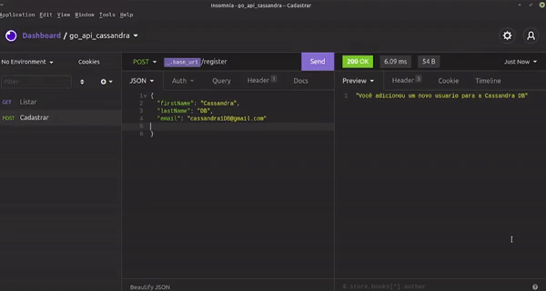

<h3 align="center">
    
</h3>
 
<p align="center"> :computer: <strong>Em progresso ...</strong> 🚧</p>

<p align="center"> 
   
  
  <a href="https://github.com/savio-2-lopes">
    
  </a>
 
 <a href="https://github.com/savio-2-lopes">
    
  </a>
</p>

<br>

## :pushpin: Índice

- [Sobre](#sobre-o-projeto)
- [Como executar](#executar)
- [Tecnologias](#tecnologia)
- [Licença](#licenca)

<br>

<a id="sobre-o-projeto"></a>

## 💻 Sobre o projeto

:book: Simples API em Go Lang conectada ao Cassandra DB

<br>

<a id="executar"></a>

## 🚀 Como executar o projeto

### Pré-requisitos

Antes de começar, você vai precisar ter instalado em sua máquina as seguintes ferramentas:
[Git](https://git-scm.com), [Go Lang](https://golang.org/) e o banco de dados [Apache Cassandra](https://cassandra.apache.org/_/index.html).
Além disto é bom ter um editor para trabalhar com o código, como [VSCode](https://code.visualstudio.com/)

<br>

#### 🧭 Configurando o banco de dados Cassandra

```bash
# Para habilitar o Apache Cassandra segue o comando abaixo:
$ cd apache-cassandra-4.0.1/ && bin/cassandra

# Em outro terminal, para se conectar ao banco de dados digite o comando abaixo:
$ cd apache-cassandra-4.0.1/ && bin/cqlsh

# Execute o seguinte comando para cria o keyspace e as tabelas
$ CREATE KEYSPACE new_db_api
   ... with replication = {
   ... 'class': 'NetworkTopologyStrategy', 'datacenter1': '1'
   ... } ;

$ use new_db_api ;

$ create table users (
   ... first_name text,
   ... last_name text,
   ... email text,
   ... primary key (email)
   ... ) ;
```

<br>

#### 🧭 Rodando a api

```bash

# Primeiramente, clone este repositório
$ git clone https://github.com/savio-2-lopes/api_go_cassandra_db.git

# Entre na pasta
$ cd api_go_cassandra_db

# Para registrar esse diretório, utilize o seguinte comando na pasta backend
$ pwd

# Cole o diretório obtido no comando abaixo
$ go mod init <DIRETORIO>

# Instale a biblioteca do gocql
$ go get github.com/gocql/gocql

# Instale a biblioteca do go-chi
$ go get github.com/go-chi/chi

# Após isso crie o package
$ go build main.go

# Execute o package criado
$ go run main.go

# O backend estará rodando em
$ http://localhost:8080

```

<br>

<a id="tecnologia"></a>

## 🛠 Tecnologias

As seguintes ferramentas foram usadas na construção do projeto:

- [Go Lang](https://golang.org/)
- [Gocql](github.com/gocql/gocql)
- [Go-chi](github.com/go-chi/chi)

<br>

<a id="licenca"></a>

## :memo: Licença

Este projeto está sob a licença do MIT. Veja a [página de licença](https://opensource.org/licenses/MIT) para mais detalhes.
